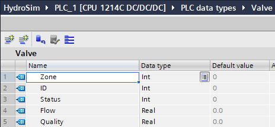
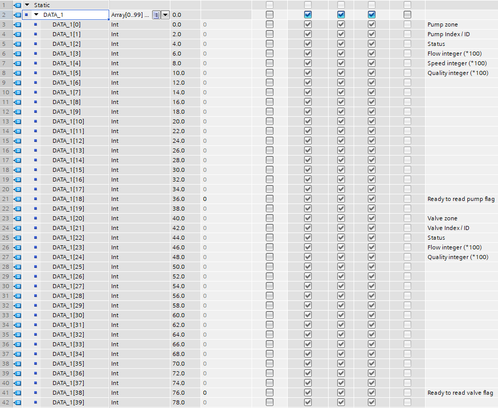
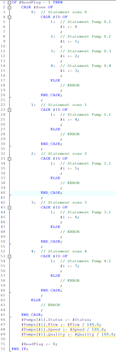
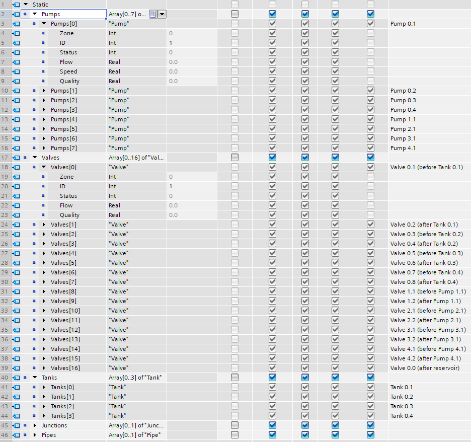
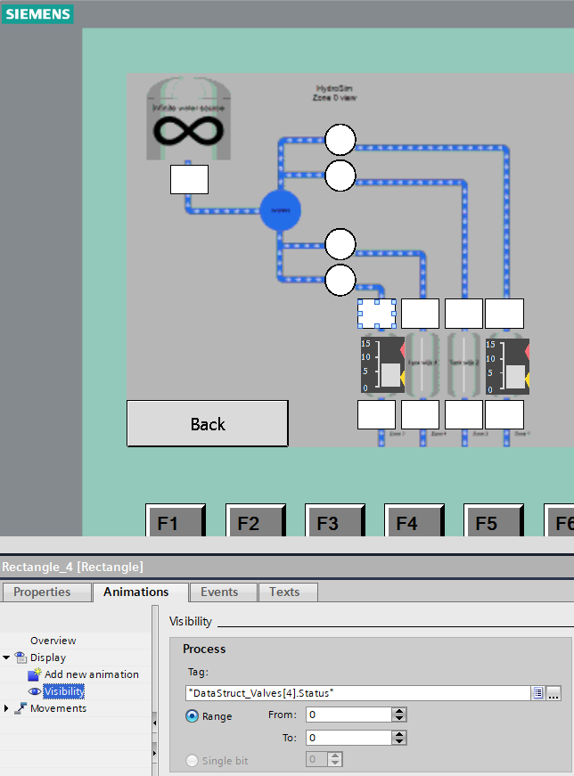

# Programmable Logic Controller (PLC)

To be able to physically demonstrate the state of the HydroSim simulator, the EPANET data is send using MQTT(S) to a gateway (in this case a Raspberry Pi). The Raspberry Pi transforms the data into Modbus instructions, that are send to the PLC. The PLC is used to make the physical representation of the HydroSim server's state. 

## Setup

The data is supplied to the PLC using Modbus TCP which has been added to the private network of the PLC (e.g. 192.168.x.x) with an UTP cable. The HMI and the PC that is used to programm the PLC are also placed in the same network using a switch. 

This project has been made using a Siemens S7-1200 1214 DC/DC/DC. If you're using a different Siemens PLC, you'll need to add your specific PLC to the project and you might need to migrate the code over to your new PLC. 

### Connecting with the PLC

To connect a PC with the PLC, you'll need 2 things: an ethernetport and Siemens TIA Portal version 15 or higher on the PC you want to use. You'll most likely need to open the networksettings of the interface you are using and manually set the IP address to be within the private network of the PLC. 

Once you're physically connected to the PLC, retrieve the `HydroSim.zap15_1` file in TIA Portal by opening TIA Portal, going to project view in the bottom left corner and going to Project -> Retrieve in the top left corner. 

Once the project has opened, click on PLC_1 in the project tree and then select "Go online" in the bar at the top. If this is the first time retrieving this project, you'll need to find the PLC on the network. Select "PN/IE" for the Type of the PG/PC interface and select the interface that is connected to the PLC. For the Connection to interface/subnet, select PN/IE_1. You can now start a search and it should find the PLC, assuming you're in the same network. Select the found PLC and click GoOnline. Now, select "download to device" in the top bar (icon with an arrow pointing down under the window tab). Follow all the steps and your PLC will get the new code.

Repeat the steps above for the HMI if you want to use the HMI.

## Data

### User Defined Type (UDT)

To simplify and organise the objects (Pump, Valve, Tank, Pipe and Junction) that are present in the HydroSim simulator, an User Defined Type (UDT) has been made for each of them. An UDT is analogous to a struct in programming languages such as C and C++. It is a way to group several related variables to (in this case) the HydroSim objects, such as the zone, ID and status among others. In structs, these related variables are called members. Figure 1 shows the UDT of the Valve, which contains the zone, ID, status, flow and quality as an int, int, int, real and real respectively:

**Figure 1: Valve UDT**

These UDT's can be made or altered in the PLC data types tab in the PLC section in TIA Portal. When a UDT is changed, this change is applied to all existing UDT's of that type.

### Dataflow

When the data arives over Modbus, an object field is filled in the Modbus DATA_1 array in a pre-set section of the array and the "Ready read flag" is set to 1. Figure 2 shows the Modbus data array used in this project:

**Figure 2: Modbus Data_1 array**

The function corresponding with the object that has been set reads that the "Ready read flag" is set to 1 and tries to determine with which object it corresponds. It does this by going through 2 switch cases, the first to check the zone of the object and the second to check the ID of the object in that zone. 

If it finds a match, the function sets a temporary variable to the array-index corresponding to the correct object in the objects-array (array of UDT's). At the end of the code, the other parameters that were set in de Data_1 array are written to that specific object's members. To indicate that the next value can be written, the "Ready read flag" is set to 0 at the end of the function. The function SCL code can be seen in Figure 3:

**Figure 3: Function code pump-function**

These arrays of UDT's are stored in a database called "DataStruct" and contains 5 arrays, one of each type of UDT. The UDT's can be identified by the combination of zone and ID (and the type of UDT) and should be unique. The rest of the members are dependend on what is wanted of that type of object and should be the same as what is send by EPANET and the gateway (Raspberry Pi). Figure 4 shows the DataStruct database with the UDT arrays:

**Figure 4: DataStruct database**

Finally the Human Machine Interface (HMI) or whatever kind of physical representation is being used can be connected to the data in the DataStruct database. In this case a HMI is being used to show that the data is correctly being send by the Raspberry Pi and interpreted by the PLC. When a pump or valve is on/open, a white circle or rectangle is shown over the corresponding pump or valve. The fill level of tank 1 and 3 are being shown by way of a levelindicator. See Figure 5 for the HMI and how it can be programmed: 

**Figure 5: HMI on the PLC**

## Testing

To check if your data is being received correctly, you can check the live values in the MODBUS_DATA and DataStruct databases. If everything is setup correctly, the values in the JSON-data being send by EPANET, should be the same as de data in the corresponding UDT.
